# Week4
# Introduction
This project extends the notebook Chapter1_Unsupervised_Learning_Methods_Michel.ipynb and applies unsupervised learning to classify radar echo signals into lead (open water) and sea ice. For each class, the mean echo waveform and its standard deviation are computed to characterize the typical echo shape. The classification results are quantitatively evaluated against the ESA reference classification using a confusion matrix. This repository documents the complete workflow for data processing, classification, and evaluation, enabling reproducible analysis.

# Unsupervised learning
* K-means Clustering

K-means clustering is well suited for this task because the radar echo waveforms from lead (open water) and sea ice exhibit distinct statistical characteristics in their amplitude and shape. Without requiring labeled training data, K-means can effectively separate echoes into groups based on similarity in the waveform feature space. In addition, the simplicity and interpretability of K-means make it particularly appropriate for exploratory analysis. By clustering the echoes into two groups, the resulting mean waveforms and standard deviations can be directly compared, enabling a clear physical interpretation of the differences between lead and sea ice echoes. The unsupervised nature of K-means also allows an independent evaluation against the ESA reference classification.

```sh
from sklearn.cluster import KMeans
import matplotlib.pyplot as plt
import numpy as np
X = np.random.rand(100, 2)
kmeans = KMeans(n_clusters=4)
kmeans.fit(X)
y_kmeans = kmeans.predict(X)
plt.scatter(X[:, 0], X[:, 1], c=y_kmeans, cmap='viridis')
centers = kmeans.cluster_centers_
plt.scatter(centers[:, 0], centers[:, 1], c='black', s=200, alpha=0.5)
plt.show()
```


* Gaussian Mixture Models
  
Gaussian Mixture Models (GMMs) are well suited for this task because radar echo waveforms from lead (open water) and sea ice often exhibit overlapping but statistically distinct distributions in feature space. Unlike K-means, which assigns each echo to a single cluster based solely on distance, GMMs model each class as a probability distribution and provide a soft assignment for each data point. This probabilistic framework allows GMMs to better capture the natural variability of echo signals and the uncertainty in class boundaries. As a result, GMMs are particularly effective for separating lead and sea ice echoes when their waveform characteristics partially overlap. In addition, the posterior probabilities produced by GMMs offer a meaningful measure of classification confidence, which can be further analyzed and compared with the ESA reference classification.
```sh
from sklearn.mixture import GaussianMixture
import matplotlib.pyplot as plt
import numpy as np
X = np.random.rand(100, 2)
gmm = GaussianMixture(n_components=3)
gmm.fit(X)
y_gmm = gmm.predict(X)
plt.scatter(X[:, 0], X[:, 1], c=y_gmm, cmap='viridis')
centers = gmm.means_
plt.scatter(centers[:, 0], centers[:, 1], c='black', s=200, alpha=0.5)
plt.title('Gaussian Mixture Model')
plt.show()
```


# Before the start
* Using pip install the data set
  ```sh
  !pip install netCDF4
  ```
  ```sh
  !pip install basemap
  ```
  ```sh
  !pip install cartopy
  ```
*  Google Drive based on Google Colab
```sh
from google.colab import drive
drive.mount('/content/drive')
```

## 🧠 Core Implementation (Full Pipeline)

The following code demonstrates the complete workflow of this project, including waveform normalization, feature extraction, Gaussian Mixture Model (GMM) clustering, and Lead / Sea Ice classification.  


```python
import numpy as np
import matplotlib.pyplot as plt
from sklearn.mixture import GaussianMixture

# Assume waveforms is a NumPy array with shape (N_samples, N_bins)
# waveforms = np.load("waveforms.npy")

N_samples, N_bins = waveforms.shape

# Normalize waveforms
waveforms_norm = waveforms / np.max(waveforms, axis=1, keepdims=True)

# Feature extraction
peak_idx = np.argmax(waveforms_norm, axis=1)
peak_val = np.max(waveforms_norm, axis=1)

tail_energy = np.array([
    np.sum(waveforms_norm[i, peak_idx[i]:])
    for i in range(N_samples)
])

features = np.column_stack((peak_val, tail_energy))

# GMM clustering
n_clusters = 5
gmm = GaussianMixture(
    n_components=n_clusters,
    covariance_type="full",
    random_state=0
)

labels = gmm.fit_predict(features)

# Cluster-wise mean waveforms
cluster_means = np.array([
    np.mean(waveforms[labels == k], axis=0)
    for k in range(n_clusters)
])

# Lead / Sea Ice separation
threshold = np.percentile(peak_val, 90)
lead_mask = peak_val > threshold
ice_mask = ~lead_mask

lead_mean = np.mean(waveforms[lead_mask], axis=0)
ice_mean = np.mean(waveforms[ice_mask], axis=0)

# Visualization
plt.figure(figsize=(6, 4))
for i in range(0, N_samples, 10):
    plt.plot(waveforms[i], alpha=0.2)
plt.title("Raw Waveforms (Sub-sampled)")
plt.xlabel("Gate Bin")
plt.ylabel("Power")
plt.show()

plt.figure(figsize=(6, 4))
plt.plot(lead_mean, label="Lead", linewidth=2)
plt.plot(ice_mean, label="Sea Ice", linewidth=2)
plt.legend()
plt.title("Average Waveforms: Lead vs Sea Ice")
plt.xlabel("Gate Bin")
plt.ylabel("Power")
plt.show()

plt.figure(figsize=(6, 4))
for k in range(n_clusters):
    plt.plot(cluster_means[k], label=f"Cluster {k}")
plt.legend()
plt.title("Mean Waveforms per GMM Cluster")
plt.xlabel("Gate Bin")
plt.ylabel("Power")
plt.show()

```

## 📊 Results (Figures)

The figures below illustrate waveform characteristics and GMM clustering results for distinguishing **Leads (specular reflection)** and **Sea Ice (diffuse scattering)**.

---

### Raw Waveforms (Overall)
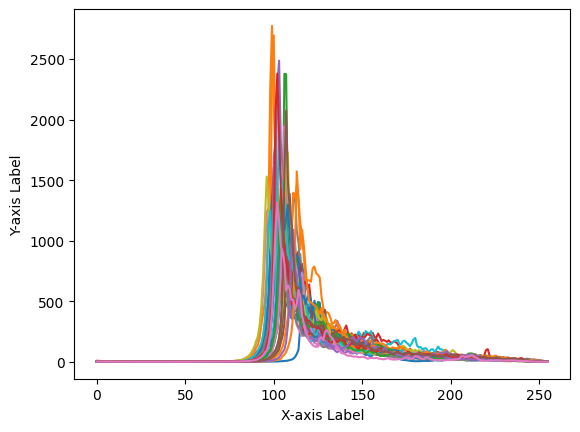

- Overlay of all raw waveforms showing similar peak locations with varying amplitudes and widths.

---

### Classified Average Waveforms (Lead vs Sea Ice)
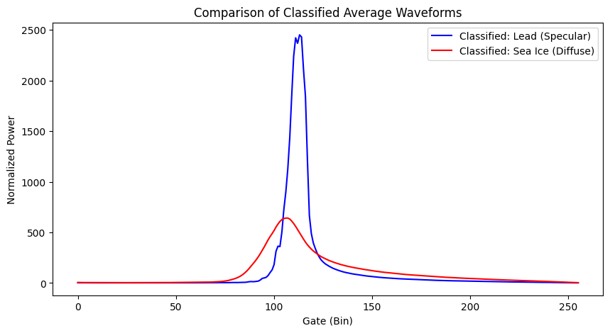

- Lead waveforms have higher, narrower peaks; Sea Ice waveforms are broader with longer tails.

---

### Example Single Waveform
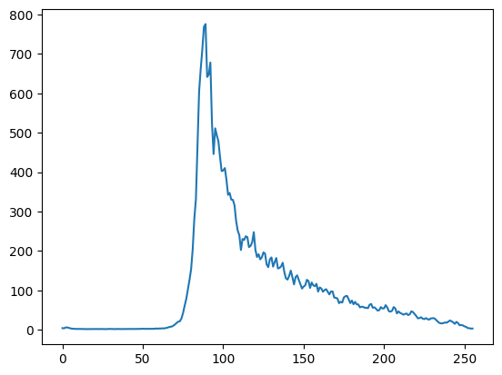

- Example of an individual waveform showing a clear main peak and decay.

---

### Individual Waveforms — Sea Ice (Sub-sampled)
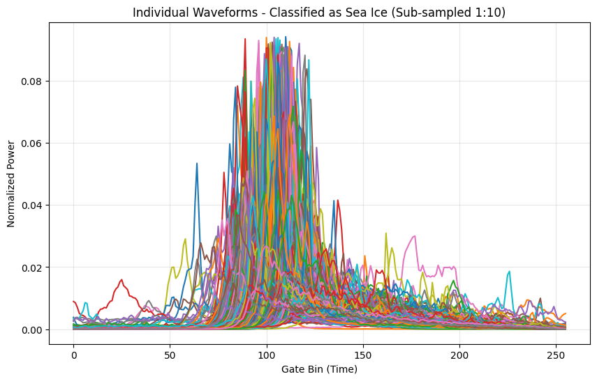

- Sub-sampled waveforms classified as Sea Ice, showing broader and more variable shapes.

---

### Individual Waveforms — Lead (Sub-sampled)
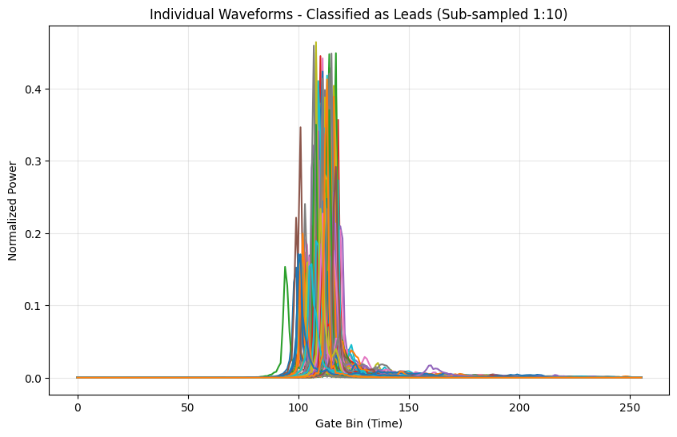

- Sub-sampled waveforms classified as Lead, characterized by sharp and concentrated peaks.

---

### GMM Cluster Example (Cluster = 0)
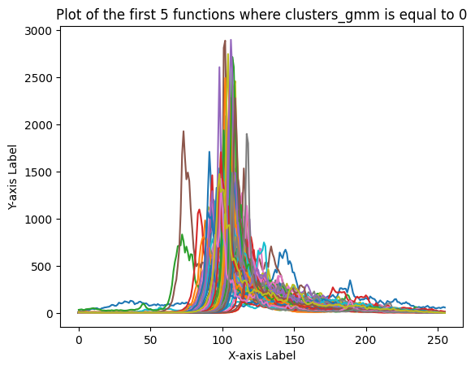

- Waveforms belonging to GMM cluster 0 (normal scale).

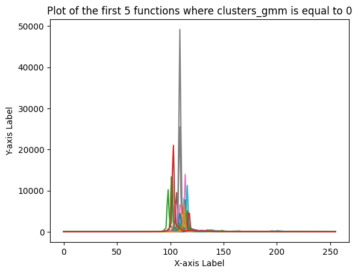

- Same cluster displayed with a larger amplitude range.

---

### Lead vs Sea Ice Comparison
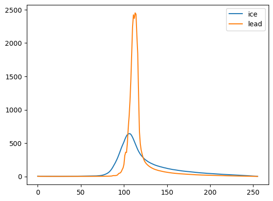

- Direct comparison highlighting the sharper Lead waveform and broader Sea Ice waveform.

---

### Mean Waveforms by GMM Cluster (5 Classes)
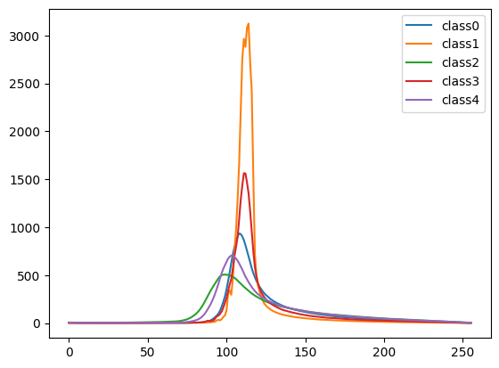

- Mean waveform for each of the five GMM clusters.

---

### Mean Waveforms by GMM Cluster (10 Classes)
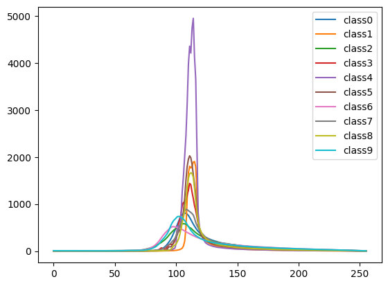

- Mean waveform for each of the ten GMM clusters.

---

### Additional Clustered Waveforms
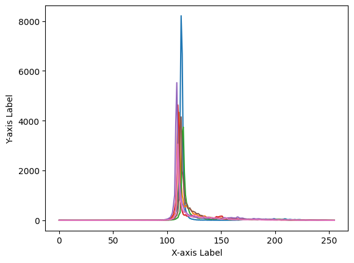

- Additional visualization of waveform grouping by GMM clustering.


For a complete demonstration of the project workflow, data processing, and analysis steps, please refer to **week4homeworkQiansiyuan.ipynb**.

