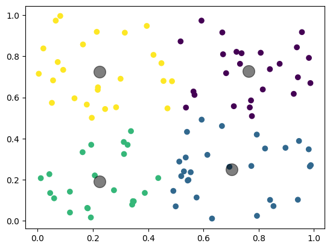
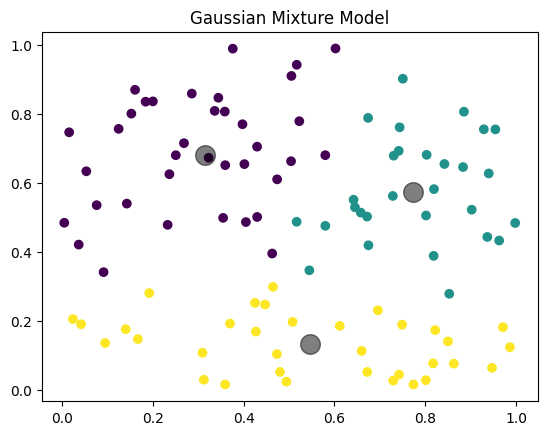

# Week4
# Introduction
This project extends the notebook Chapter1_Unsupervised_Learning_Methods_Michel.ipynb and applies unsupervised learning to classify radar echo signals into lead (open water) and sea ice. For each class, the mean echo waveform and its standard deviation are computed to characterize the typical echo shape. The classification results are quantitatively evaluated against the ESA reference classification using a confusion matrix. This repository documents the complete workflow for data processing, classification, and evaluation, enabling reproducible analysis.

# Unsupervised learning
-K-means Clustering

K-means clustering is well suited for this task because the radar echo waveforms from lead (open water) and sea ice exhibit distinct statistical characteristics in their amplitude and shape. Without requiring labeled training data, K-means can effectively separate echoes into groups based on similarity in the waveform feature space. In addition, the simplicity and interpretability of K-means make it particularly appropriate for exploratory analysis. By clustering the echoes into two groups, the resulting mean waveforms and standard deviations can be directly compared, enabling a clear physical interpretation of the differences between lead and sea ice echoes. The unsupervised nature of K-means also allows an independent evaluation against the ESA reference classification.


-Gaussian Mixture Models

Gaussian Mixture Models (GMMs) are well suited for this task because radar echo waveforms from lead (open water) and sea ice often exhibit overlapping but statistically distinct distributions in feature space. Unlike K-means, which assigns each echo to a single cluster based solely on distance, GMMs model each class as a probability distribution and provide a soft assignment for each data point. This probabilistic framework allows GMMs to better capture the natural variability of echo signals and the uncertainty in class boundaries. As a result, GMMs are particularly effective for separating lead and sea ice echoes when their waveform characteristics partially overlap. In addition, the posterior probabilities produced by GMMs offer a meaningful measure of classification confidence, which can be further analyzed and compared with the ESA reference classification.



# Before the start
Connect the 
```sh
from google.colab import drive
drive.mount('/content/drive')
```
